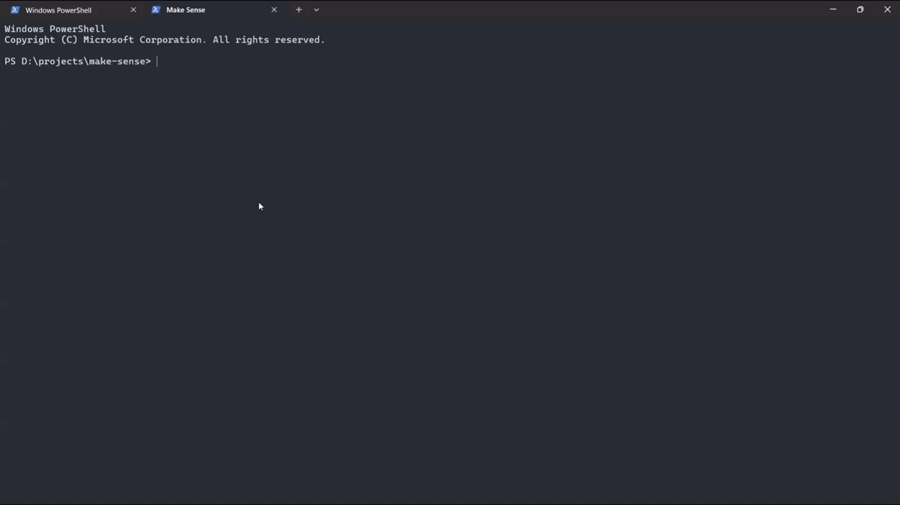

# Make Sense

Make Sense converts research paper PDFs into structured, beginner-friendly explainer documents. Upload a paper, and the pipeline extracts its content, rewrites it into a clear explanation aimed at first-time readers, and returns a formatted PDF.

The following demo shows the application in use. 
<div align="center">
  
</div>


[sample_output.pdf](sample_output.pdf) is an example explanation generated from "Attention Is All You Need."

## Overview

Research papers are often dense and assume significant background knowledge. Make Sense takes a paper PDF and produces a restructured explanation that:

- Explains concepts in plain language before introducing formal notation
- Preserves formulas as properly rendered LaTeX
- Keeps original figures and tables in context
- Reads as a clean, formatted PDF rather than raw markdown

## How It Works

The pipeline runs in three stages, each implemented as an independent module that can also be run directly from the command line.

### 1. PDF to Markdown (`src/make_sense/parser.py`)

Uses [Marker](https://github.com/datalab-to/marker) to convert the uploaded PDF into markdown, extracting text, tables, formulas, and images. Marker runs on CPU, using a local `llama.cpp` server rather than a GPU-based backend, configured through `marker_config.json`.

```
python parser.py path/to/paper.pdf
```

### 2. Markdown to Explanation (`src/make_sense/model.py`)

Sends the extracted markdown to an LLM with a fixed system prompt (`prompt.txt`) that rewrites the paper into a structured explainer. Requests are attempted against a configurable chain of models, falling back to the next on failure:

1. A list of OpenRouter models, defined in [project_variables](project_variables.ini)
2. Gemini, called directly, used as the final fallback

Failures are handled per model: rate limits, server errors, malformed responses, and provider-level error payloads are all caught, logged, and the next model in the chain is tried automatically.

```
python model.py path/to/markdown.md
```

### 3. Explanation to PDF (`src/make_sense/pandoc.py`)

Converts the final explanation markdown into a formatted PDF using Pandoc with the Tectonic LaTeX engine. Output styling (margins, font, table of contents, colored links) is defined directly in the markdown's YAML frontmatter, generated as part of stage 2. I will move the styling to a separate config file in a future update, for now if you run the below code, the output won't have any styling.

```
python pandoc.py path/to/markdown.md
```

### Application Entry Point (`app.py`)

A Gradio interface ties the three stages together: a user uploads a PDF, the interface reports progress through each stage, and returns a download link for the finished PDF once complete. Uploaded files and intermediate outputs are kept in separate directories (`Uploads/` and `Temp/`) so that each new run starts from a clean working state without interfering with an in-progress upload. I'll add more robust file management in a future update. For now, this is good enough for a single user running the app locally.


## Project Structure

```
src/make_sense/
  parser.py      - PDF to Markdown (Marker)
  model.py       - Markdown to explanation (LLM calls with fallback)
  pandoc.py      - Explanation to final PDF (Pandoc + Tectonic)

app.py                 - Gradio entry point
marker_config.json     - Marker configuration
project_variables.ini  - Model names and fallback order
logging_config.json    - Logging configuration
prompt.txt             - System prompt used for explanation generation
demo.gif               - Application walkthrough
sample_output.pdf       - Example output (Attention Is All You Need)
pyproject.toml
uv.lock
```

## Requirements

- Python 3.10+
- [uv](https://docs.astral.sh/uv/) for dependency and environment management
- Pandoc
- Tectonic (LaTeX engine)
- A `llama-server` binary (llama.cpp), used as Marker's CPU-based inference backend
- An OpenRouter API key
- A Gemini API key

## Setup

1. Install dependencies:

   ```
   uv sync
   ```

2. Set the environment variables `OPENROUTER_API_KEY` and `GEMINI_API_KEY`.

3. Ensure Pandoc, Tectonic, and a `llama-server` binary are available, and that `LLAMA_CPP_BINARY` and `SURYA_INFERENCE_BACKEND` are set in the environment before Marker is imported. Configuration files (`marker_config.json`, `project_variables.ini`, `logging_config.json`, `prompt.txt`) should be present in the project root.

## Usage

Run the application:

```
uv run app.py
```

This starts a local Gradio interface. Upload a PDF and the interface will report progress through each pipeline stage before returning a download link for the finished explainer PDF. Since the goal is to provide a local solution without requiring a GPU, no GPU is used in the pipeline, expect some delay in the processing time. I'll add a GPU-based option in a future update.

## Configuration Notes

- **Model fallback order** is defined in `project_variables.ini`, listing OpenRouter models under `[OPENROUTER]` and the Gemini fallback under `[GEMINI]`.
- **Marker behavior** (mode, OCR settings, LLM-assisted correction, retry timing) is defined in `marker_config.json` and loaded through a `MarkerSettings` model.
- **Logging** is configured via `logging_config.json` using Python's `dictConfig`. The project's own logger (`make_sense`) is verbose by default; third-party library loggers are kept quiet.
- **Output PDF styling** (margins, font, table of contents) is generated as YAML frontmatter alongside the model's response and consumed directly by Pandoc.

## Limitations

- Processing time depends on paper length and the availability of the configured LLM providers.
- Formula and table extraction quality depends on Marker's output; unusual PDF layouts may not convert cleanly.
- Free-tier LLM models vary in reliability; the fallback chain is intended to reduce, not eliminate, occasional failures.

## Future Work
- Add GPU-based inference option for faster processing.
- Improve file management to allow multiple concurrent uploads and processing.
- PDF styling configuration will be moved to a separate config file for easier customization.